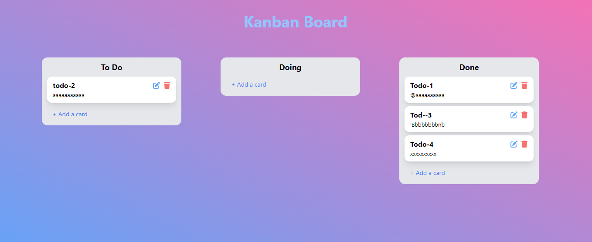

<h1>Kanban Board Project</h1>

Here is the project's short description:

<ul>

<li>The web app is a Task management app. User can mange their task by status of the task.</li>

<li>All tasks, segregated by their status groups: To Do, Doing, Done
 </li>

 <li>
 User can add new tasks and edit the task and can delete tasks.</li>
 </li>

  <li>
 Users can effortlessly drag and drop tasks between the To Do,
Doing, and Done categories and it is also saved the sorted list in the database instantly
 </li>

   <li>
 The application is fully functional and visually coherent on
mobile devices.
 </li>
   

</ul>

<h1>Technology and Package Used for the Website:</h1>

<ul>
<li>
 React JS
</li>
<li>
 Express JS
</li>
<li>
 MongoDB database
</li>
<li>
 Tanstack Query
</li>
<li>
 React-hot-toaster
</li>
<li>
 React-sortablejs
</li>
<li>
sortablejs
</li>

<li>
 Firebase hosting 
</li><li>
 Sweetalert v2
</li>
</ul>

<h1>The Live Link of Web app</h1>

<strong>Link:</strong> <a>https://kanban-board-2e5bb.web.app</a>

<h1>The Server-side Link of Web app</h1>

<strong>Link:</strong> <a>https://github.com/nahianku1/kanban-board-server</a>

<h1>The screen-shot the of Web app</h1>

